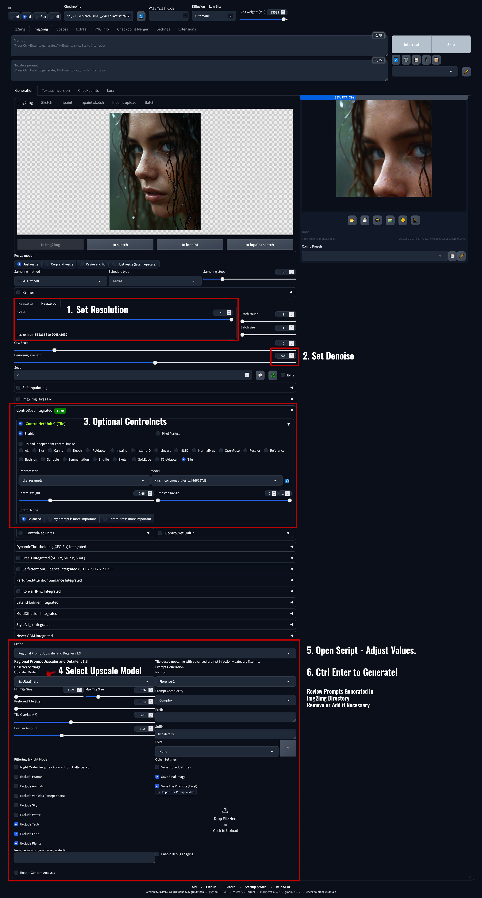
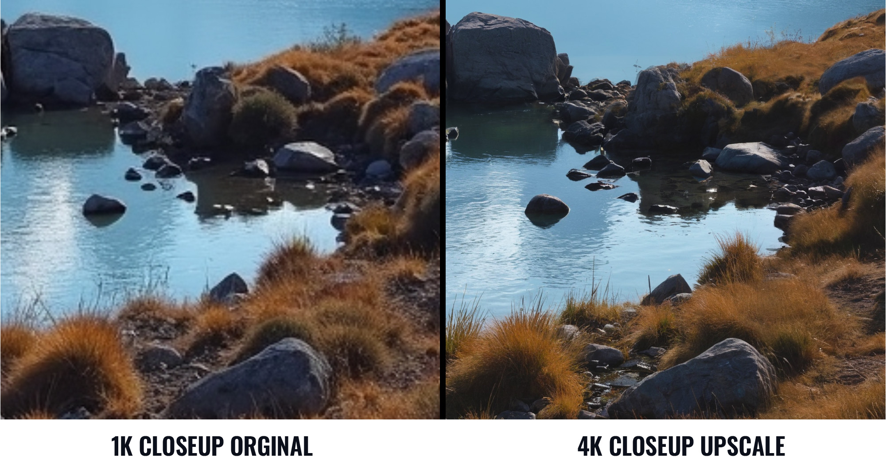

# **Regional Prompt Upscaler and Detailer**

**Version:** 1.3  
**Author:** [Matthew Hallett](https://hallett-ai.com)

The **Regional Prompt Upscaler and Detailer** is an upscaler+detailer extension for **Automatic1111 Web UI** and **Forge**, based on [Ultimate Upscale for Automatic1111](https://github.com/Coyote-A/ultimate-upscale-for-automatic1111). It enhances the process by automatically applying region-specific prompts for each tile before generation, leveraging four different Vision-Language Models (VLMs). This approach adds fine details in specific areas while preserving large, smooth sections like skies—keeping them free of artifacts or hallucinations. Unlike ControlNet-Tile, which can constrain new detail generation or transformations when combined with LoRAs, this extension offers more freedom and nuance.

## **Features**

- **Auto Prompt Generation Methods Per Tile**  
  Generate region-specific prompts using **BLIP**, **Florence-2**, **CLIP**, or **ViT-GPT2**, each providing a unique style of image detection.

- **Easily Remove False Prompts Before Generation**  
  Remove prompts before generation that you know will cause undesirable hallucinations

- **Auto Tile Scaling**  
  Dynamically chooses tile size based on your image dimensions, ensuring efficient tiling and consistent results.

- **Regional Prompt Export/Import via Excel**  
  Export tile prompts to a .xlsx file for batch editing, then re-import them to streamline your workflow.  
  Example of an exported Excel file:
  
  

- **Simple or Complex Prompt Modes**  
  Quickly switch between short (“Simple”) or in-depth (“Complex”) prompts, depending on the detail level you want.

- **Advanced Feathering & Overlap**  
  Control feathering and overlap percentages to blend tiles seamlessly without visible transitions.

- **Convenient LoRA Selection**  
  Apply LoRA models via a straightforward dropdown. The script injects these settings into each tile prompt automatically.

- **No Resolution Limits**  
  Upscale far beyond 4X by repeatedly applying multi-generation upscaling and prompt control, achieving extremely high resolutions.

- **Works with Flux, SD, SDXL & SD3**  
  Fully compatible with modern pipelines, letting you leverage your preferred models and control methods.

---

## **Benefits**

1. **Granular Regional Customization**  
   Apply unique prompts to specific image regions for ultra-fine control.

2. **Integrated & Easy to Use**  
   Fully embedded in Automatic1111 and Forge, with a simple installation process.

3. **Automation for Efficiency**  
   Handles prompt creation, tiling, and blending automatically, so you get high-quality results with minimal manual overhead.

4. **Flexible Prompt Length**  
   Toggle between simple or detailed prompts for creative freedom or quick iteration.

5. **Professional Results**  
   Ideal for architectural renders, aerial photography, or any creative composition requiring clarity and detail.

---

## **Installation**

### **Option 1: Automatic Installation (Recommended)**

1. **Download** this repository or grab the ZIP from the [Releases](../../releases).
2. Extract the contents to a folder on your computer.
3. Run the `install_free_upscaler.bat`:
   - The installer automatically locates your Automatic1111 or Forge root folder.
   - It copies all required files and installs dependencies.
4. Restart your WebUI. The extension will appear in the **Extensions** tab.

### **Option 2: Manual Installation**

1. **Download** this repository or grab the ZIP from the [Releases](../../releases).
2. Extract the contents somewhere on your computer.
3. Copy the following files/folders into your WebUI installation:
   - `__init__.py` and `requirements.txt` into:  
     ```
     <WebUI Directory>/extensions/regional-prompt-upscaler-hallett/
     ```
   - Contents of the `scripts/` folder into:  
     ```
     <WebUI Directory>/extensions/regional-prompt-upscaler-hallett/scripts/
     ```
4. Install dependencies by running (in your WebUI environment):
   ```bash
   pip install -r extensions/regional-prompt-upscaler-hallett/requirements.txt
   ```
5. Restart your WebUI. The extension will now appear in the **Extensions** tab.

---

## **Usage**

1. **Load an Image**  
   In the **img2img** tab of your WebUI, load the image you want to upscale.

2. **Set Scaling & Denoising**  
   - Choose a **Resize** (e.g. 4X).  
   - Adjust **denoising strength** (e.g. **0.3–0.5**). A sweet spot is around **0.38** for balanced detail.

3. **Configure Tiles & Prompts**  
   - **Tile Size**: Typically **1024**, but adjustable based on your image.  
   - **Feather Amount** & **Overlap**: Control how tiles blend (e.g., 50 feather, 20% overlap).  
   - **Prompt Generation**: Select BLIP, Florence-2, CLIP, or ViT-GPT2.  
   - **LoRA**: Quickly apply a LoRA model; the script updates prompts automatically.

4. **Generate the Upscaled Image**  
   - Click **Generate** to process each tile with its own region-aware prompt.

Here’s an example of typical settings:  


5. **Optional Excel Editing**  
   - Export tile prompts to Excel, batch-edit them, then re-import for precise control.

6. **Enjoy the Results**  
   - You’ll get a final upscaled image with region-specific enhancements and smooth transitions.

Example output showing improved detail and seamless blending:  


---

## **Requirements**

- **Python 3.8+**
- **Automatic1111 WebUI** or **Forge**
- **Python Libraries** (installed via `requirements.txt`):
  - `torch`
  - `transformers`
  - `openpyxl`
  - `numpy`
  - `opencv-python`
  - `Pillow`
  - `gradio`
  - `clip-interrogator`

---

## **Changelog**

### **v1.3**
- All Free Except for Night Conversions
- Enhanced category filtering (including user-defined words).
- More flexible tile arrangement logic.
- Minor UI cleanup.

### **v1.2**
- Added batch installer for smooth setup.  
- Introduced feathering and overlap sliders for better blending.  
- Improved compatibility with Flux/SDXL.  
- Enhanced LoRA dropdown for quick selection.  
- Integrated Florence-2 for more robust prompt generation.

---

## **Contributing**

Contributions are welcome! Feel free to open issues or submit pull requests for improvements.

---

## **License**

Licensed under the [GPLv3 License](LICENSE). You can use and modify the software, but derivative works must also remain open-source under the same terms.

---

## **Credits**

Inspired by [Coyote-A's Ultimate Upscale for Automatic1111](https://github.com/Coyote-A/ultimate-upscale-for-automatic1111). We appreciate the foundational ideas and scripts that made this extension possible.

---

## **Contact**

For support, feature requests, or commercial inquiries, visit [Hallett Visual](https://hallett-ai.com) or reach out via the website.
