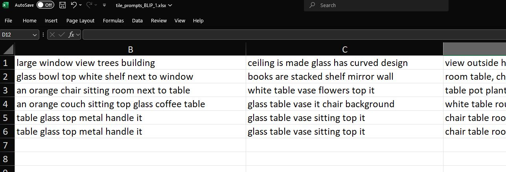
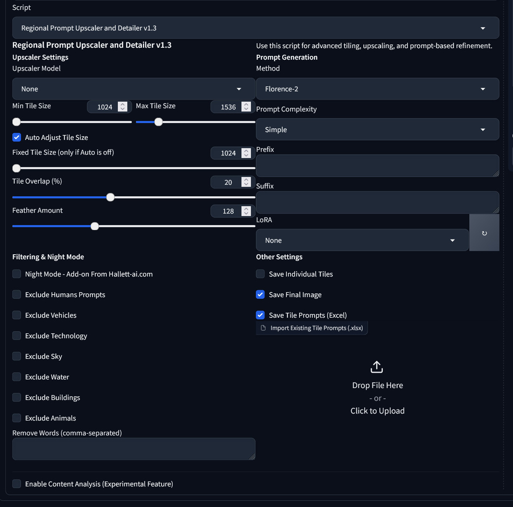
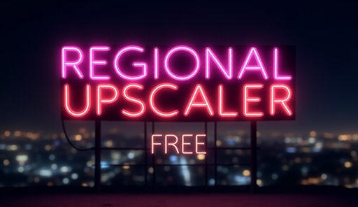

# **Regional Prompt Upscaler**

**Version:** 1.2  
**Author:** [Hallett Visual](https://hallett-ai.com)

The **Regional Prompt Upscaler** is a powerful extension for **Automatic1111 Web UI** and **Forge**. It takes your upscaling workflow to the next level by splitting images into tiles and applying region-specific prompts generated with advanced Vision-Language Models (VLMs). Whether you're working on artistic renders, architectural imagery, or complex visual projects, this tool delivers unmatched precision and control.

---

## **Features**

- **Four Prompt Generation Methods**:
  Generate region-specific prompts using BLIP, Florence-2, CLIP, or ViT-GPT2 for detailed image detection.
  
- **Auto Tile Scaling**:
  Automatically adjusts tile size based on the dimensions of your image for efficient processing and optimal results.
  
- **Regional Prompt Export to Excel**:
  Export tile prompts to an Excel file for batch editing and re-import them to streamline your workflow.  
  Example of an exported Excel file:  
  
  
- **Simple or Complex Prompt Options**:
  Choose between concise or detailed prompts depending on your project's requirements.

- **Enhanced Feathering and Overlap**:
  Adjust feathering and overlap percentages for smooth blending of tiles without visible edges or seams.

- **Quick LoRA Selection**:
  Easily apply LoRA models via a convenient dropdown menu. LoRA settings are automatically injected into the prompt.

- **Unlimited Upscaling**:
  Go beyond the default 4X limit in WebUI by combining multi-generation upscaling with prompt control, enabling any resolution.

- **Works Seamlessly with Flux, Stable Diffusion (SD), and SDXL**:
  Fully compatible with modern models, allowing flexibility across different pipelines.

---

## **Benefits**

1. **Precise Regional Customization**:
   Apply unique prompts to individual regions of your image for precise enhancements.

2. **Streamlined Workflow**:
   Fully integrated into Automatic1111 and Forge, the upscaler is easy to install and operate.

3. **Automated Efficiency**:
   Automates prompt creation, tile management, and blending for faster results without compromising quality.

4. **Flexible Output Control**:
   Choose between simple prompts for speed or complex prompts for highly detailed outputs.

5. **Professional Results**:
   Perfect for architectural renders, aerial photography, and creative compositions with stunning clarity and detail.

---

## **Installation**

### **Option 1: Automatic Installation (Recommended)**

1. **Download the repository** or get the ZIP file from the [Releases](../../releases) page.
2. Extract the contents to a folder on your computer.
3. Run the `install_free_upscaler.bat`:
   - The installer will detect your Automatic1111 or Forge root directory.
   - It copies all required files and installs dependencies automatically.
4. Restart your WebUI. The extension will now appear in the "Extensions" tab.

---

### **Option 2: Manual Installation**

1. **Download the repository** or get the ZIP file from the [Releases](../../releases) page.
2. Extract the contents to a folder on your computer.
3. Copy the following files and folders to your WebUI installation:
   - `__init__.py` and `requirements.txt` into:
     ```
     <Your WebUI Directory>/extensions/regional-prompt-upscaler-hallett/
     ```
   - Contents of the `scripts/` folder into:
     ```
     <Your WebUI Directory>/extensions/regional-prompt-upscaler-hallett/scripts/
     ```
4. Install dependencies by running:
   ```bash
   pip install -r extensions/regional-prompt-upscaler-hallett/requirements.txt
   ```
5. Restart your WebUI. The extension will now appear in the "Extensions" tab.

---

## **Usage**

### **1. Load an Image**
Navigate to the **img2img** tab in WebUI. Choose your input image for upscaling.  

Example interface:  


---

### **2. Set Scaling and Denoising Strength**
- Use the "Resize by" option (e.g., 4X) to specify the upscale factor.
- Adjust the **denoising strength** based on your project:
  - **0.3–0.5 for visible changes** (recommended: **0.38** for balance).  

Example of settings in WebUI:  


---

### **3. Configure Tile and Prompt Settings**
- **Tile Size**: Adjust based on your image dimensions (default: **1024**).
- **Feather Amount**: Set feathering (e.g., **50**) for smoother blending.
- **Overlap Percentage**: Choose overlap for seamless tile transitions (e.g., **20%**).
- **Prompt Generation Method**: Select from BLIP, Florence-2, CLIP, or ViT-GPT2 for accurate prompt creation.
- **LoRA Selection**: Add LoRA models for additional control. The selection updates the prefix automatically.

---

### **4. Process the Image**
Click **Generate** to upscale the image region by region. Each tile is processed with its assigned prompt.

---

### **5. Export and Import Prompts (Optional)**
Save tile prompts to an Excel file for batch editing or reuse in future projects.  
Export example:  


---

### **6. Final Output**
The upscaled image will include enhanced details with smooth tile blending.  

Example of upscaled output:  


---

## **Requirements**

- **Python 3.8+**
- **Automatic1111 WebUI** or **Forge**
- Required Python libraries (installed via `requirements.txt`):
  - `torch`
  - `transformers`
  - `openpyxl`
  - `numpy`
  - `opencv-python`
  - `Pillow`
  - `gradio`
  - `clip-interrogator`

---

## **Changelog**

### **v1.2**
- Improved batch installer for seamless setup.
- Added advanced feathering and overlap controls for smooth blending.
- Enhanced compatibility with Flux, SDXL, and Stable Diffusion pipelines.
- Streamlined LoRA dropdown functionality for faster selection.
- Integrated Florence-2 for better prompt detection and generation.

---

## **Contributing**

We welcome contributions! If you have suggestions, bug reports, or improvements, feel free to submit an issue or pull request on GitHub.

---

## **License**

This project is licensed under the [GPLv3 License](LICENSE). You are free to use and modify the software, but derivative works must also remain open-source under the same license.

---

## **Contact**

For support, feature requests, or commercial inquiries, visit [Hallett Visual](https://hallett-ai.com) or contact us via the website.
