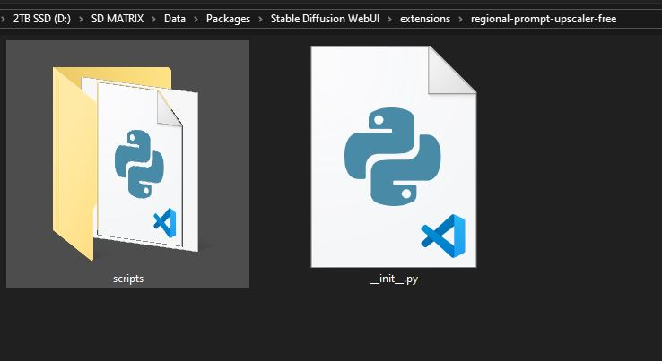
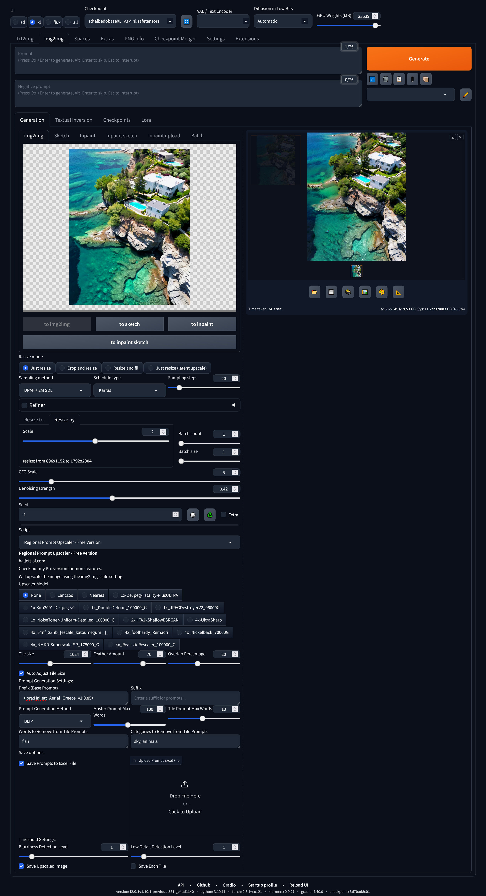

# Regional-Prompt-Upscaler
Works similar to the Ultimate Upscaler except that uses Vision-Language Models to generate prompts for each tile.  Plus a collection of other features.

# Regional Prompt Upscaler for Automatic1111

This extension allows users to upscale images using regional prompts with the Automatic1111 web UI or Forge. It provides flexibility in enhancing specific regions of an image using different prompts.

### Key Points Included:
- **Features**: Explains what the tool does and how it enhances images based on region-specific prompts.
- **Installation**: Provides step-by-step instructions for cloning the repository and setting up the extension with Automatic1111 or Forge.
- **Usage**: Simple steps to guide users on how to define regions, input prompts, and run the upscaling process.
- **Requirements**: Lists the basic requirements and dependencies needed for the project.
- **Examples**: Shows input and output examples (you can add images or screenshots in the `assets/` folder).
- **Contributing**: Encourages contributions from the community.
- **License**: The project is licensed under **GPLv3**, which you have chosen.

1. **Clone the repository**:
   ```bash
   git clone https://github.com/HallettVisual/Regional-Prompt-Upscaler.git
   ```

2. **Copy the scripts**: Move the contents of the `scripts/` folder into the `extensions/` folder of your **Automatic1111 Web UI** or **Forge** installation.

3. **Restart your Web UI**: After restarting, the extension should be available under the "Extensions" tab.

## Usage

Once installed, the **Regional Prompt Upscaler** can be accessed through the Web UI interface. Here's how to use it:

1. **Load an Image**: Select an image that you want to upscale.
2. **Define Regions**: Mark the areas in the image where you want different prompts to apply.
3. **Enter Prompts**: Input the prompts for each defined region. The upscaling model will use these prompts to guide the enhancement process.
4. **Run the Upscaler**: Click "Upscale" to apply the prompts to the selected regions and generate the final image.

## Requirements

Ensure the following requirements are met to use the extension:

- **Python 3.8+**
- **Stable Diffusion Web UI (Automatic1111)** or **Forge**
- Python libraries such as:
  - `gradio`
  - `torch`
  - `PIL` (Pillow)

You can install these dependencies with the following command:
```bash
pip install -r requirements.txt
```

### Input Image



### Upscaled Output



In this example, different prompts were applied to different regions of the image, resulting in an intelligently upscaled image.

## Contributing

Contributions are welcome! Feel free to submit issues, suggestions, or pull requests to improve the project.

## License

This project is licensed under the [GPLv3 License](LICENSE). You are free to use the software and modify it, but any derivative works must also be open-source and distributed under the same license.

## Contact

For commercial inquiries, reach out at [your contact info or website].
```
